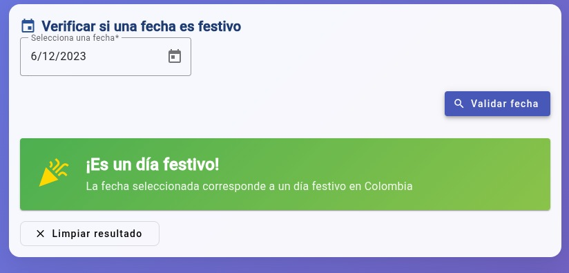
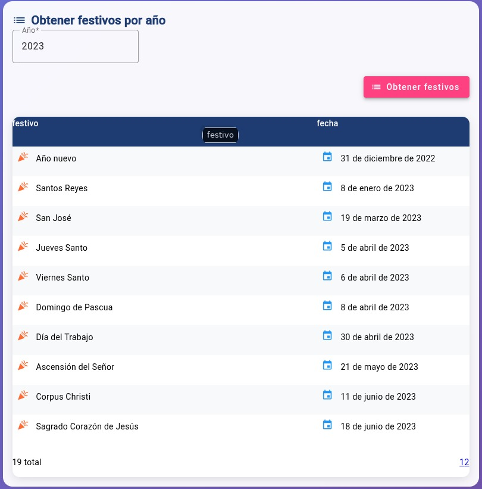

---

# 🚀 Taller Final - Aplicación Web con Spring Boot y Angular

Este proyecto es el resultado final del curso de **Técnicas de Programación**, y consiste en una aplicación para consultar los festivos de cada año desarrollada con:

- 🎯 **Backend**: Spring Boot (Java)
- 🎨 **Frontend**: Angular

La estructura del proyecto está organizada en carpetas separadas para el cliente (frontend) y el servidor (backend), cada una con su propio README.

---


## 🧱 Estructura del Proyecto

```

Taller\_Final/
├── backend/        # API REST con Spring Boot
│  
├── frontend/       # Interfaz de usuario con Angular
│ 
└── README.md       # Archivo actual (general)

````

---

## ✨ Tecnologías Utilizadas

| Tecnología     | Descripción                        |
|----------------|------------------------------------|
| Spring Boot    | Framework para construir APIs REST |
| Angular        | Framework frontend SPA             |
| Maven   | Gestión de dependencias (backend)  |
| TypeScript     | Lenguaje para Angular              |
| HTML/CSS       | Maquetado y estilos (frontend)     |

---

## ⚙️ Cómo Ejecutar el Proyecto

### 📦 Backend (Spring Boot)

```bash
cd backend
./mvnw spring-boot:run
````

La API estará disponible por defecto en: `http://localhost:8080`

### 💻 Frontend (Angular)

```bash
cd frontend
npm install
ng serve
```

La aplicación se podrá visualizar en: `http://localhost:4200`

---

## 📌 Funcionalidades Principales

- ✅ CRUD completo de entidades
- ✅ Comunicación entre frontend y backend vía HTTP (REST)
- ✅ Validaciones en frontend y backend
---

## 📷 Capturas de Pantalla

*Vistas de la aplicación*





---

## 👨‍💻 Autor

**\[Efraín Hurtado]**
Estudiante de la UdeA
📧 Contacto: \[[efrain.hurtado@udea.edu.co](mailto:efrain.hurtado@udea.edu.co)]

---

